# Home Page Text & UX Review

## Overview
This document presents the results of **static testing** of the Home page texts and UI/UX.
The focus is on:

- Consistency of text and terminology
- UX clarity and cognitive understandability
- Visual coherence and user interaction
- Improvement of CTAs and informational blocks

Recommendations are divided into:

- **Quick Fixes** – minor UX and text issues that require immediate attention
- **Long-term UX Improvements** – broader changes moved to Improvement tasks

 # Quick Fixes

## 1. Неконсистентність назв пунктів меню в хедері

**Current**

> UA: Тарифи   /   Як працює   /   Категорії
> EN: Price List /  How it works  / `Category`
>
> &nbsp;

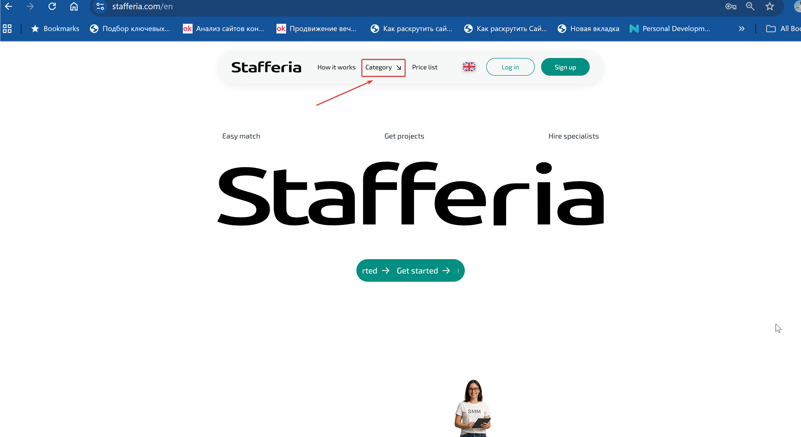

**Expected**

> UA: Тарифи / Як працює / Категорії
> EN: Price List / How it works / `Categories`
>
> &nbsp;

**Recommendation**
>
> Виправити `Category` → `Categories`, оскільки це список категорій (множина).
>
> &nbsp;

## 2. Неконсистентність стилю назв кнопок у хедері

**Current**

> UA: Увійти / Реєстрація
>
> &nbsp;

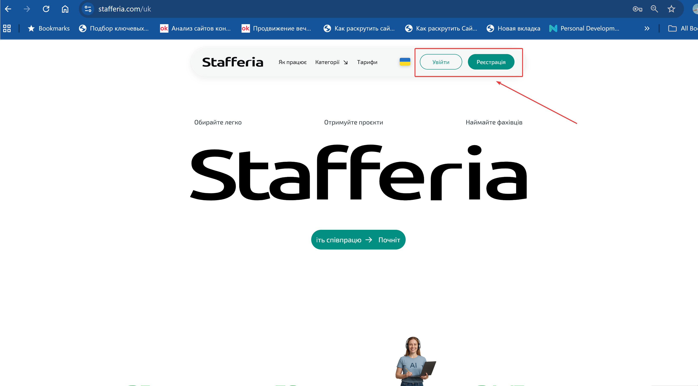

**Expected**

> UA: Увійти / Зареєструватися
>
> або
>
> UA: Вхід / Реєстрація

**Recommendation**

> Для кращого UX краще використовувати узгоджений стиль:  
> - **Дієслівний стиль**: `Увійти / Зареєструватися` (рекомендовано для кнопок дій)  
> - **Іменниковий стиль**: `Вхід / Реєстрація` (може підходити для меню або розділів)

## 3. Узгодити використання Title Case у заголовках

**Current**

> Top `categories` / How `it` `works` / Popular `questions`
>
> &nbsp;

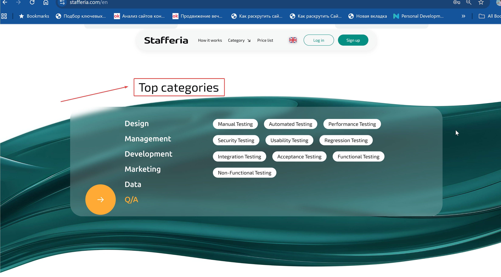
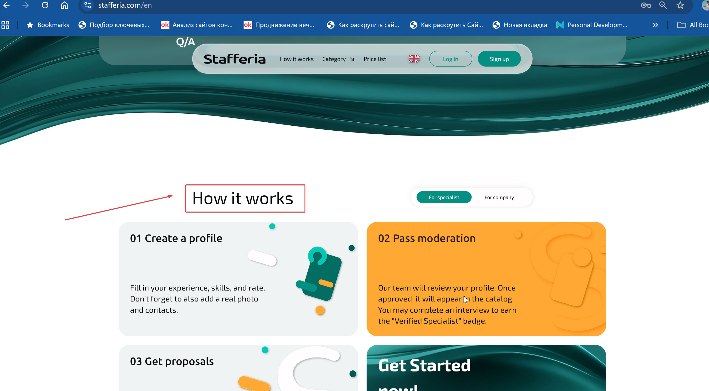
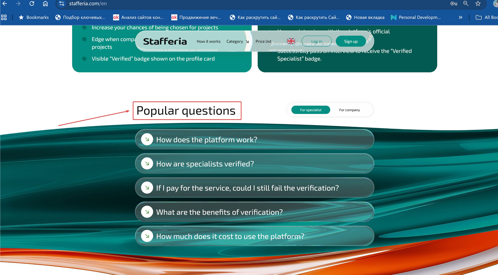

**Expected**

> Top `Categories` / How `It` `Works` / Popular `Questions`
>
> &nbsp;

**Recommendation**

> Застосувати Title Case до всіх заголовків для узгодженості стилю на сайті.
>
> &nbsp;

## 4. Підвищити візуальну відмінність заголовків у таблиці “Cost to Unlock Specialist’s Contact”

**Current**

> Назви колонок візуально не відрізняються від даних.

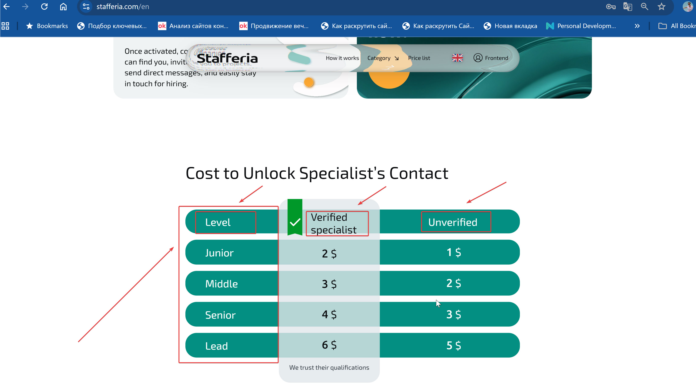

**Expected**

> Заголовки колонок виділені: змінено колір тексту або зроблено шрифтом **жирним**, щоб вони чітко відрізнялися від даних.

**Recommendation**

> Виділити заголовки колонок у таблиці:  
> - Зробити текст жирним (**Bold**)  
> - Або змінити колір тексту  
> - Або інші стилі для покращення візуальної ієрархії і сприйняття інформації.

## 5. Неконсистентність та мовні неточності у назвах документів у футері

**Current**

> Term / Private policy / Cookies policy

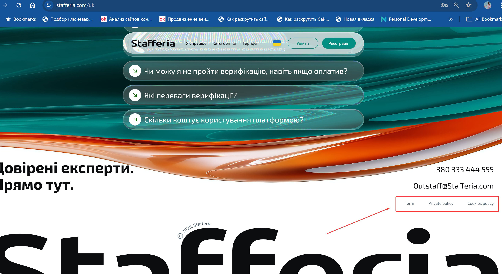

**Expected**

> Terms / Privacy Policy / Cookie Policy

**Recommendation / Explanation**

1. Документ містить багато умов, тому використано **Terms** (множина).  
2. **Privacy Policy** означає «політика конфіденційності» — документ, який пояснює, як сайт збирає, зберігає та використовує персональні дані користувачів.  
   - «Private policy» звучить як «приватна політика», що не має сенсу в UX/юридичному контексті.  
3. У назвах політик і стандартних документах використовують **однину**: **Cookie Policy**, навіть якщо сайт працює з багатьма файлами cookie.  
   - Використання множини «Cookies Policy» не є помилкою у повсякденному мовленні, але в офіційних назвах документів і на сайтах стандартом вважається однина.
  
---

   # Long-term UX Improvements

## 1. Інформаційний рядок (“Easy match”, “Get projects”, “Hire specialists”)

**Current**

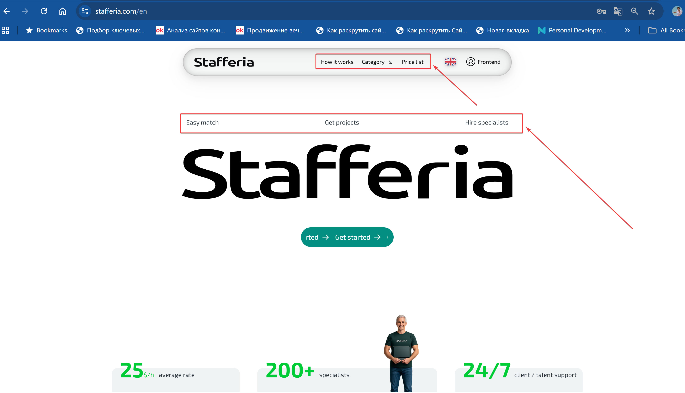

> “Easy match” / “Get projects” / “Hire specialists”

**Problem**

> - Інформаційний рядок візуально нагадує пункти головного меню, однак його елементи **не є клікабельними**.  
> - Користувач інтуїтивно очікує, що натискання призведе до переходу на іншу сторінку, але нічого не відбувається.  
> - Це викликає **фрустрацію** – відчуття розчарування або недовіри до інтерфейсу.

**Recommendation / Explanation**

> - Змінити візуальне оформлення рядка.  
> - Для швидкої реалізації – прибрати рядок повністю, оскільки він не додає суттєвої інформаційної цінності та лише створює когнітивне навантаження.

#### 2. Неконсистентність інтерактивності у блоці “How it works?”

**Current**
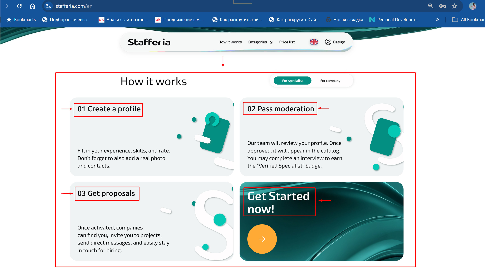
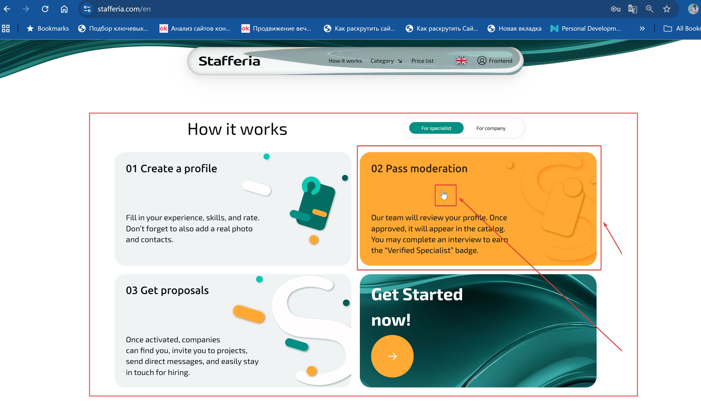
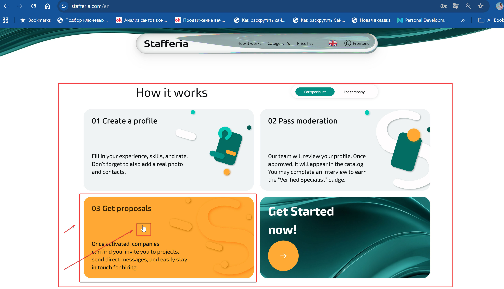

> - Блок містить 4 прямокутники однакового розміру та форми, усі мають hover-ефект.  
> - Три з них візуально відрізняються, але поведінка всіх чотирьох елементів схожа: при наведенні курсор змінюється на «лапку», що сигналізує про можливість натискання.  
> - Користувач сприймає всі прямокутники як клікабельні. Насправді лише четвертий прямокутник – “Get started now!” – є клікабельним.  
> - Вводить в оману третій прямокутник “Get Proposals”, заголовок якого схожий на клікабельний “Get started now!”, що підсилює відчуття інтерактивності.  

**Problem**

> - Візуальні сигнали (форма, hover-ефект, курсор) не узгоджені з фактичною функціональністю.  
> - Коли ця мова порушується, користувач витрачає час і сили, щоб зрозуміти, що працює, а що ні.  
> - Це знижує довіру до системи та створює відчуття, що сайт недопрацьований або має технічні помилки.  

**Recommendation / Explanation**

> Для швидкої реалізації:  
> - Прибрати hover-ефект для перших трьох прямокутників.  
> - Змінити курсор з «лапки» на стандартний (default) для перших трьох прямокутників.  
> - Оновити заголовки перших трьох карток для кращої зрозумілості:  
>   
>     - Step 1: Profile Creation  
>     - Step 2: Moderation Process  
>     - Step 3: Receiving Proposals  
>     - Step 4: Get Started Now!  

> Довгостроково:  
> - Перелік кроків зробити більш візуально відокремленим від кнопки для переходу на реєстрацію, щоб уникнути оманливих очікувань клікабельності.

