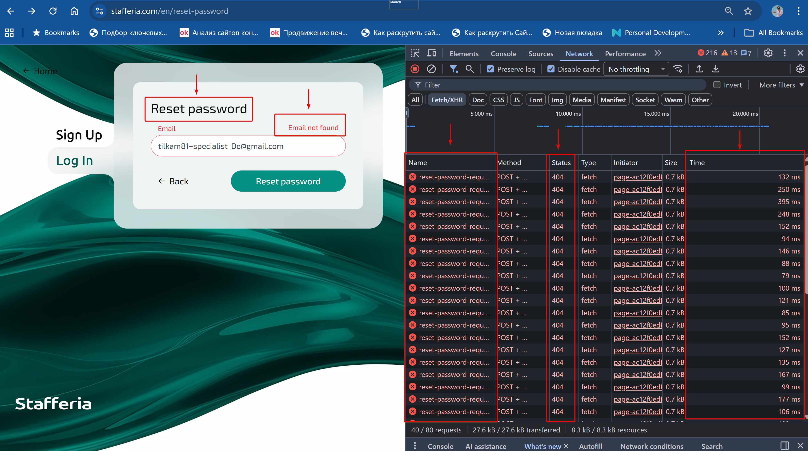
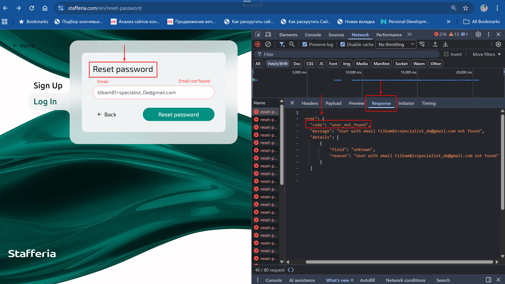

# Security Improvement: Preventing Email Enumeration in Password Reset Flow

**Project Type:** Security Enhancement Proposal
**Role:**QA Engineer
**Focus:** Security risk identification, authentication flow consistency, attack surface reduction

---

## TL;DR

- Форма **Password Reset** розкриває наявність email через повідомлення **“Email not found”**, що суперечить логіці **Login**. 
- API повідомляє про відсутність користувача з конкретним email.  
- У поєднанні з відсутністю обмежень на кількість спроб такий алгоритм дозволяє виконувати необмежений перебір акаунтів (**email enumeration**).

Запропоновано спрощену логіку **Reset Password**, яка не розкриває наявність email і корелює з логікою **Login**.

---

## Goal
Усунути можливість визначення зареєстрованих email через форму Password Reset та забезпечити узгоджену security-логіку в межах усього authentication flow.

---

## Environment
- **API:** http://api.stafferia.com  
- **Browser:** Google Chrome 141.0.7390.122  
- **OS:** Windows 11 Home 25H2  
- **Module:** Authentication (Login & Password Reset)
- **Priority:** High


## Problem Description
У формі Password Reset система відображає підказку:

“Email not found”

якщо введений email не зареєстрований у базі даних.

---


## Core Issue
Система розкриває факт існування або відсутності email через UI-підказку “Email not found”. Відсутність ліміту спроб введення дозволяє зловмиснику виконувати необмежений перебір email-адрес (email enumeration attack).


## Пояснення проблеми:
- У формі Password Reset користувач бачить повідомлення “Email not found” для неіснуючих email.
- Легітимному користувачу ця інформація не потрібна для відновлення паролю, бо він повинен знати свій email.
- Відсутність ліміту спроб введення дозволяє зловмиснику перевіряти наявність акаунтів без обмежень.


## API-Level Vulnerability 
Аналіз DevTools → Network показує, що endpoint reset-password-request:
приймає необмежену кількість POST-запитів

У вкладці Response сервер повертає:

```json
{
  "code": "user_not_found",
  "message": "User with email ... not found"
}

```

API явно повідомляє про відсутність користувача з конкретним email, що разом із необмеженими спробами робить атаку реальною.


## Inconsistency in Authentication Flow
- Логіка Login використовує узагальнене повідомлення “Incorrect email or password”, що відповідає принципу мінімального розкриття інформації.
- Логіка Password Reset (перехід через посилання “Forgot password?”) явно розкриває наявність або відсутність email.
  
**Проблема**

Принцип мінімального розкриття інформації порушується всередині одного модуля автентифікації: Login приховує наявність email, а Password Reset одночасно її розкриває, що створює явне протиріччя в логіці безпеки.

**Таким чином:**
- Захисна логіка Login фактично обходиться альтернативним сценарієм.
- Security-стратегія стає непослідовною.

## Risks for the Platform

- Розкриття зареєстрованих email (спеціалістів та компаній).
- Порушення принципу мінімізації розкриття інформації.
- Репутаційні ризики та зниження довіри користувачів і партнерів.


## Proposed Behavior

- Бекенд виконує перевірку email, але не розкриває результат користувачу.  
- API повертає уніфіковану відповідь незалежно від існування email.  
- Незалежно від того, чи email є в базі, після натискання Reset Password користувач перенаправляється на сторінку з повідомленням: **“Check your email…”**.  
- Лист із інструкціями надсилається лише на зареєстровані email.  
- Валідація формату email відображає підказку тільки у випадку некоректного формату.

**Переваги:**

- Легітимний користувач не втрачає функціональність.
- Зловмисник не отримує інформації для перебору email.


## Security Impact
- Усунення email enumeration vulnerability.
- Забезпечення послідовної security-логіки між Login та Password Reset.
- Підвищення захисту даних користувачів.
- Підвищення довіри до платформи.


## Acceptance Criteria
- Якщо користувач вводить email з валідним форматом і натискає Reset Password, він перенаправляється на сторінку **“Check your email…”** незалежно від наявності email у БД.  
- Повідомлення **“Email not found”** не відображається.  
- Відповідь API є уніфікованою незалежно від існування email.  
- Лист із посиланням на відновлення паролю надсилається лише для зареєстрованих email.
- Валідація формату email працює незалежно від security-логіки.


## Attachments
**Скріншоти:**  
-   
  - UI з повідомленням **“Email not found”**  
  - DevTools → Network з серією POST-запитів  
  - Статуси 404  
  - Відсутність обмежень (багато запитів підряд)
    

