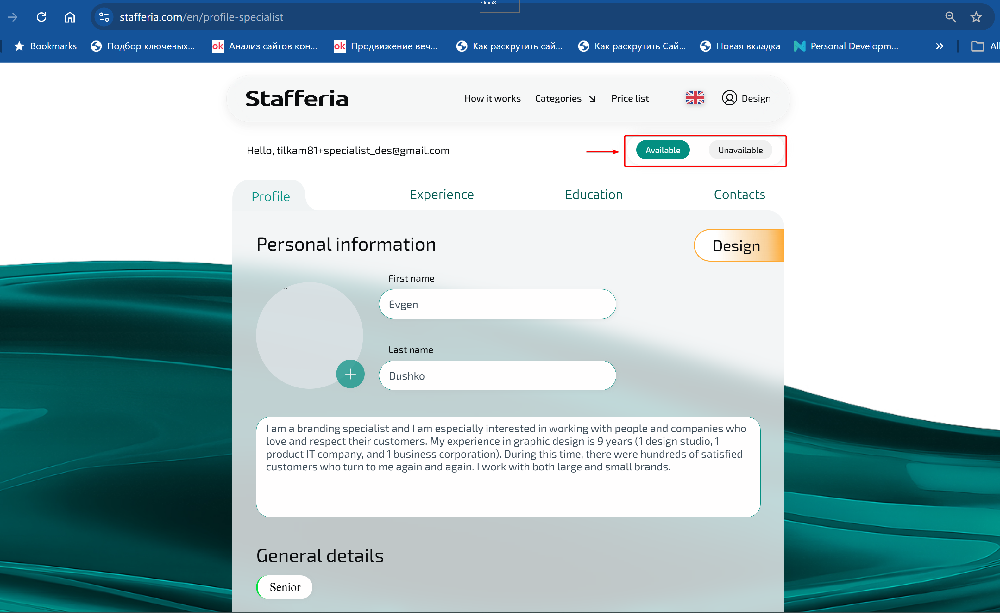
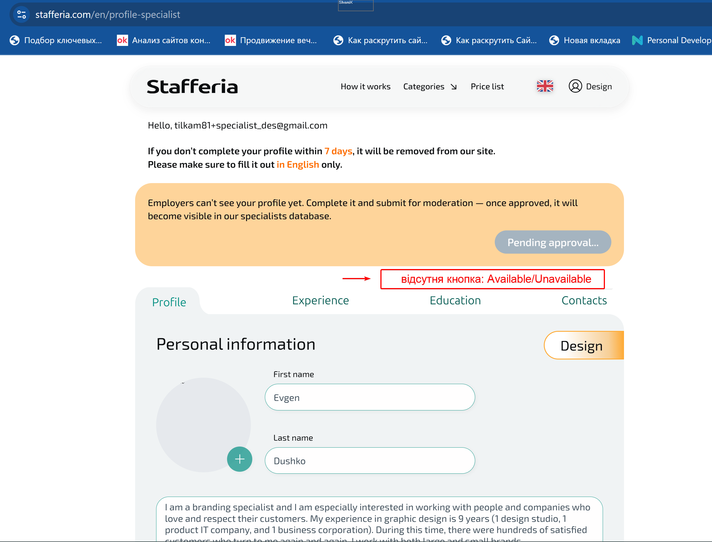

# Improvement: Clarification of Available / Unavailable Button Logic

**Project Type:** Enhancement Proposal  
**Role:** QA Engineer  
**Focus:** Business logic consistency, FE/BE synchronization, state-based control validation  

### Status
Improvement approved and accepted for implementation.

## TL;DR
Логіка роботи кнопки `Available / Unavailable` залежно від статусу профілю недостатньо формалізована, що створює ризик різної інтерпретації на FE та BE.  
Було запропоновано спрощення та узгодження логіки кнопки для всіх статусів. Обговорено з BA та FE, уточнено з BE щодо впливу на БД.
                                                                             
## Environment
- API: http://api.stafferia.com  
- Postman: v11.68.4-251023-0629  
- Browser: Google Chrome 141.0.7390.122  
- OS: Windows 11 Home 25H2  

## Goal
Спростити та узгодити логіку роботи кнопки `Available / Unavailable` залежно від статусу профілю, щоб забезпечити її коректну поведінку у всіх можливих кейсах і уникнути розсинхронізації між FE та BE.

## Current Situation
Профіль не відображається в каталозі для статусів: `DRAFT`, `PENDING`, `PART_BLOCK`, `TIMER_BLOCK`, `FULL_BLOCK`.

Поведінка кнопки `Available / Unavailable` для цих статусів:

- не зафіксована достатньо чітко в специфікації;  
- реалізується або інтерпретується по-різному на FE та BE;  
- призводить до надмірної умовної логіки (наприклад, заборона доступу до кнопки для статусу `TIMER_BLOCK` не має бізнес-сенсу).

## Proposed Logic

### 1. Pre-Approved Statuses:
``DRAFT / PENDING / PART_BLOCK``  

Кнопка ``Available / Unavailable`` відсутня.  

**Обґрунтування:**  

- Профіль не пройшов модерацію  
- Профіль невидимий у каталозі  
- Керування доступністю не має сенсу

### 2. Post-Approved Statuses:
``TIMER_BLOCK / FULL_BLOCK / APPROVED / CONFIRMED``  

Кнопка ``Available / Unavailable`` присутня.  

**Обґрунтування:**  

Кнопка вперше з’являється у статусі `APPROVED`, коли профіль стає валідним та затвердженим.  
У статусах `TIMER_BLOCK` та `FULL_BLOCK` бізнес-результат забезпечено через ключове обмеження – профіль невидимий у каталозі і недоступний для замовників.

Кнопка `Available / Unavailable` зберігається як “спадкова” від `APPROVED` і не потребує додаткового блокування, оскільки:

- не впливає на бізнес-результат;   
- ускладнює логіку на FE/BE;  
- ускладнює відновлення після закінчення обмежень.

### Summary of Button Rules

- Для статусів ``DRAFT / PENDING / PART_BLOCK`` кнопка ``Available / Unavailable`` не відображається.  
- Кнопка ``Available / Unavailable`` має бути доступна після успішного проходження модерації та отримання статусу ``APPROVED``, а також для профілів, що додатково отримали статус ``CONFIRMED`` після верифікації скілів.  
- Для статусів `TIMER_BLOCK / FULL_BLOCK` кнопка зберігається, оскільки бізнес-результат у вигляді недоступності користувача для замовників забезпечується ключовим обмеженням — невидимістю профілю в каталозі.

### Таблиця: Логіка кнопки ``Available / Unavailable`` по статусах

| Статус профілю | Каталог (видимість) | Кнопка ``Available / Unavailable`` | Коментар / Обґрунтування |
|----------------|-------------------|-------------------------------|---------------------------|
| ``DRAFT``          | Невидимий         | Відсутня                      | Профіль не пройшов модерацію; керування доступністю не має сенсу |
| ``PENDING``        | Невидимий         | Відсутня                      | Профіль не пройшов модерацію; керування доступністю не має сенсу |
| ``PART_BLOCK``     | Невидимий         | Відсутня                      | Профіль не пройшов модерацію; керування доступністю не має сенсу |
| ``APPROVED``       | Видимий           | Присутня                      | Кнопка з’являється вперше; профіль валідний |
| ``CONFIRMED``      | Видимий           | Присутня                      | Додатковий статус після верифікації скілів |
| ``TIMER_BLOCK``    | Невидимий         | Присутня (спадкова логіка)   | Профіль вже проходив модерацію; ключове обмеження – невидимість; бізнес-результат забезпечено |
| ``FULL_BLOCK``     | Невидимий         | Присутня (спадкова логіка)   | Профіль вже проходив модерацію; ключове обмеження – невидимість; бізнес-результат забезпечено |

### Impact
- Усунення розсинхронізації FE / BE  
- Зменшення умовної логіки 
- Спрощення майбутніх змін  
- Фіксація state-based behavior

## Screenshots

**Кнопка присутня:**   
`Available / Unavailable` (статус APPROVED)  

**Кнопка відсутня:**  
`Available / Unavailable` (статус PENDING)

